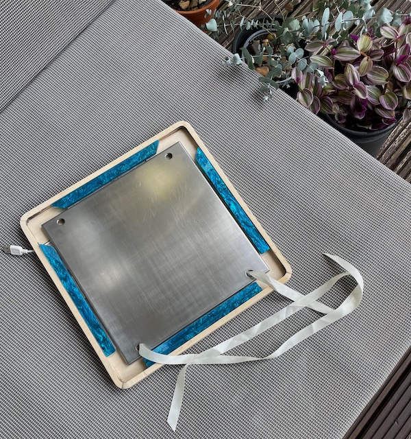
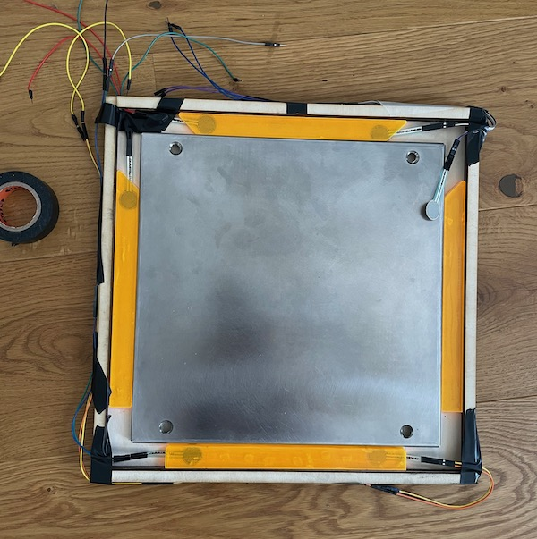
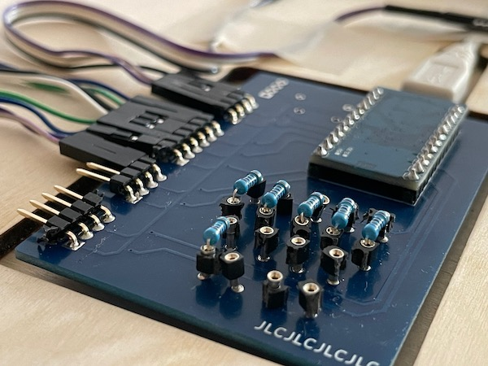
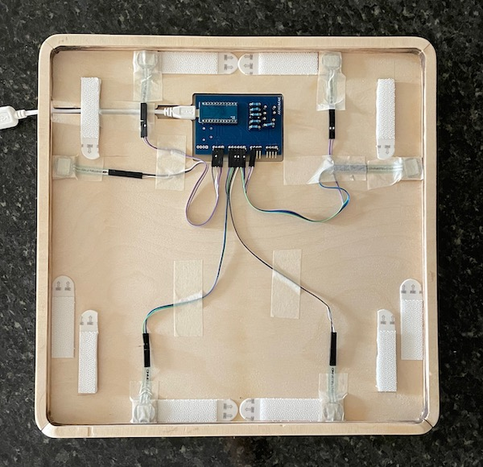
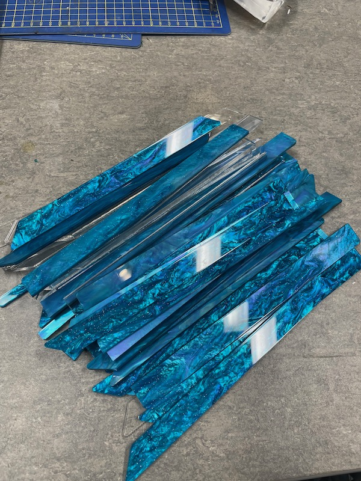
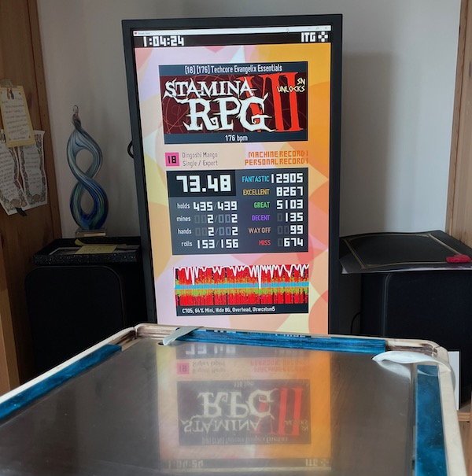

# Travel pads
This is a showcase of travel pads I made, and things I learned along the way.
You can find me at Stamina Nation discord #pads @sereni for questions and comments.

## Requirements
Before starting the project, we need to understand the requirements. These will dictate what is important, and what can be traded off. If you're building a pad, your requirements may be very different.

What my pad is:
1. It is a stamina pad that handles streams up to 250 BPM and marathons of ~1hr.
1. The panels are extremely sensitive and do not misfire. The sensitivity does not drift over time.
1. The sensitivity and the height of the panels can be adjusted independently.
1. The pad fits into a carry-on bag for travel, and is light enough to allow other stuff in the carry-on.
1. The pad uses the exact same center panel I use on my arcade pad. Polishing that one took eons and I'm not doing it again.
1. The pad is relatively quick to set up after transportation, and doesn't lose settings when moved.

What my pad is not:
1. It is not a product for sale, meant to work for multiple people out of the box, or meant to withstand years of use without adjustments.
1. It is not a tech pad. It will only be used with minimal based form. This means my weight holds the pad down as I play, and it doesn't need to be heavy, nor does it need to have big panels.

### A note on tools
The tools and skills you have will shape the construction of your pad and materials you can use. I have no hardware skills, but I do have access to a laser cutter. Because of that, all the wooden pads have been CAD'ed for cutting in thin plywood, then glued together cake-like. The earlier foam prototypes were done the same way, with a hobby knife. I like the layered construction because it allows to shape features like wire grooves and borders without any woodworking skills or equipment. Also, laser-cut ply smells deliciously of barbecue.

## Pads
I took a few iterations to achieve all the requirements. I am documenting them from the best and most recent version, and will be filling out the rest over time.

### The small one

Let's get it out of the way: the pad is SMALL. I gambled on how much panel estate I need, and won. Even then, the gameplay is punishing, because this pad does not tolerate form breakdown. If I lose it, I lose it, there is no mashing or widening that can save us.

On the bright side, this size allows us a very solid build. Let's go over the features.

#### Prototyping
Before anything, prototype prototype prototype. Normally I start with foam to understand the shape of the pad, how the center panel and the sensors hold, where the wires go, etc. I knew most of this from previous attempts, so I put together a wooden frame right away to playtest the panel size. This convinced me it's worth to put the effort and the polish into the end product.

#### One piece construction
This pad is a one-piece, meaning there is no disassembly of the base for transportation. This is tricky, because the carry-on size limit is 34 cm a side. The limit can be avoided by splitting the pad into multiple pieces, but this brings a whole other set of problems — see next designs. The tiny 2 cm panels let us fit the entire design into 34 cm. By making it a one piece, we gain a sturdy base that does not wobble or bend, and that in turn gets us consistent sensor readings.

The base consists of 3 layers of 4 mm ply glued together. I used wood glue and kept each part clamped for a good bond. The borders are 3 more layers. There is a cutout in the topmost layer to accommodate the PCB and the USB wire. There is an additional 4 mm ply piece under each of the sensors, and under the velcro bits that support the center panel.

The panels are laser-cut acrylic of varied thickness (more on that later).

Here are the [drawings for laser cutting](https://cad.onshape.com/documents/4f4f7c02e75b1c43639cfe17/w/a39e86fb38e2100b868e28ef/e/c6c7652937759c546924c0b4?renderMode=0&uiState=64ac2b52e79b6d6e9e25d7ee).

#### FSR
All of the pads I made use force-sensitive resistors as sensors. If this is new to you, read the [FSR pad guide](sereni.github.io/fsr-pad-guide). FSRs are responsive, small, and their sensitivity can be adjusted digitally.

#### Arduino and PCB
This is an Arduino Pro Micro with [XeaL's PCB](https://github.com/alex-ong/ddr_pcb). I soldered it the wrong side up to sandwich the USB port between PCBs and save a few mm of height. The total thickness is 9 mm, and it tucks under the center panel. I used a [clever test](small/lipstick.jpeg) to make sure the board doesn't touch the center panel and short something accidentally.

#### Velcro
Panels are held down with velcro. Regular velcro doesn't hold very well when the panel moves sideways, so I use heavy duty plastic velcro instead. It's about 3 mm thick, so the panel rests firmly and (ever so slightly) bent on the 4 mm raised sensors when clicked in.

This entire design is enabled by velcro — shoutouts to [Reflex](https://reflex.dance/) for the idea. Any kind of bracket or screw fixing would have been too big for the size of the panels. In addition, velcro doesn't wobble, doesn't clank, and doesn't tighten over the course of play, which solves a lot of instability in sensor readings. (Clanking doesn't cause instability, just annoys the heck out of me.)

The center panel is also fixed with velcro. I reuse the same center panel on my arcade setup, so velcro is placed in such a way that it doesn't get in the way when the panel is attached to the full-sized pad.

#### Modding
There are three things I want to mod about my pad:
1. Panel sensitivity – solved by FSRs.
2. Panel responsiveness – solved by hot-swappable resistors.
3. Panel height – uhhh

People usually adjust panel height by stuffing tape under it. Velcro makes it impossible. It's also bad, because it also somehow messes up the sensitivity.

To work around that, I simply cut four sets of panels in 6 to 9 mm height. ¯\\\_(ツ)\_/¯

#### Does it work?
It survived a marathon! I'm a little rusty on speed but I'll let ya know if it survives 250 when I get there.

### The split one

### The puzzle one

### The foam one

### The entirely foam one

### Others
